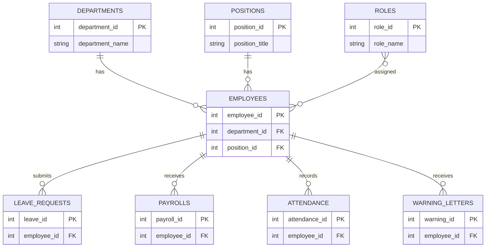

# Entity Relationship Diagram

## Relationships

| # | Relationship | Type |
|---|-------------|------|
| 1 | Department → Employees | One-to-Many |
| 2 | Position → Employees | One-to-Many |
| 3 | Employee → Leave Requests | One-to-Many |
| 4 | Employee → Payrolls | One-to-Many |
| 5 | Employee → Attendance | One-to-Many |
| 6 | Employee → Warning Letters | One-to-Many |
| 7 | Roles ↔ Employees | Many-to-Many |
